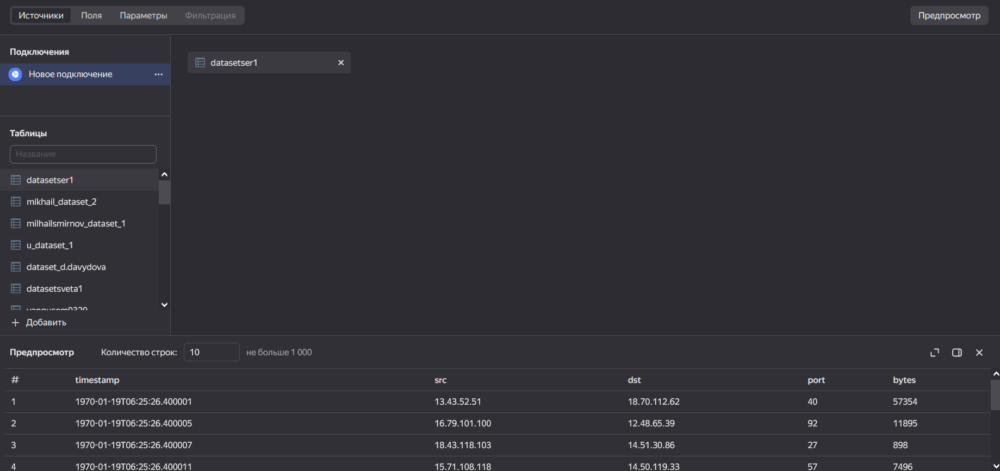
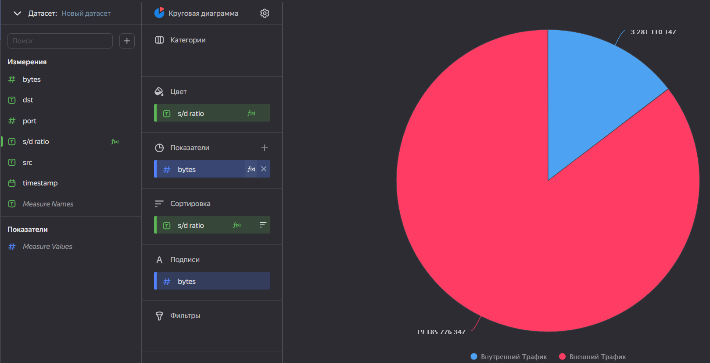
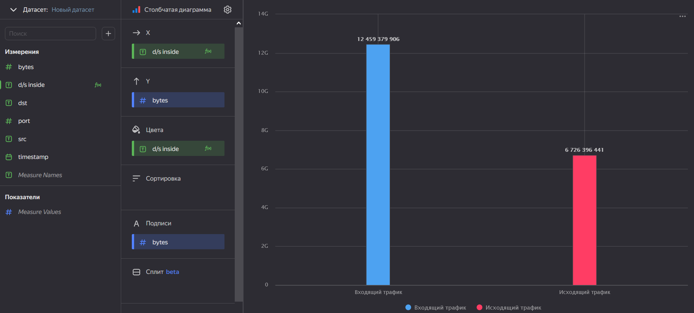
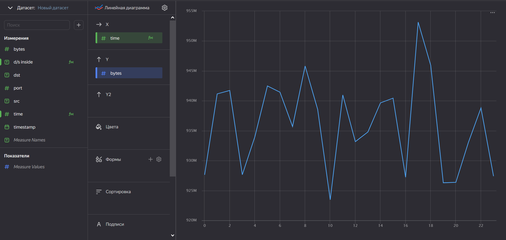

# lab2

## Цель Работы

1.  Изучить возможности технологии Yandex DataLens для визуального
    анализа структурированных наборов данных
2.  Получить навыки визуализации данных для последующего анализа с
    помощью сервисов Yandex Cloud
3.  Получить навыки создания решений мониторинга/SIEM на базе облачных
    продуктов и открытых программных решений
4.  Закрепить практические навыки использования SQL для анализа данных
    сетевой активности в сегментированной корпоративной сети

## Ход работы

### Настроить подключение к Yandex Query из DataLens

-   Перейти в соответствующий сервис – <https://datalens.yandex.ru/>

-   Выбрать “Подключения” – “Создать новое подключение”

-   Выбрать в разделе “Файлы и сервисы” Yandex Query

-   Настроить и проверить подключение


### Создать из запроса YandexQuery датасет DataLens



## Задание 1

Представить в виде круговой диаграммы соотношение внешнего и внутреннего
сетевого трафика

    IF (([src] LIKE '12.%' or [src] LIKE '13.%' or [src] LIKE '14.%') and ([dst] LIKE '12.%' or [dst] LIKE '13.%' or [dst] LIKE '14.%'))
        THEN 'Внутренний Трафик'
    ELSE
        'Внешний Трафик'
    END



## Задание 2

Представить в виде столбчатой диаграммы соотношение входящего и
исходящего трафика из внутреннего сетвого сегмента.

    IF (([src] like '12.%' or [src] like '13.%' or [src] like '14.%') and ([dst] not like '12.%' and [dst] not like '13.%' and [dst] not like '14.%'))
        THEN 'Исходящий трафик'
    ELSEIF (([dst] like '12.%' or [dst] like '13.%' or [dst] like '14.%') and ([src] not like '12.%' and [src] not like '13.%' and [src] not like '14.%'))
        THEN 'Входящий трафик'
    ELSE
        NULL
    END



## Задание 3

Построить график активности (линейная диаграмма) объема трафика во
времени.

    int([timestamp])%24



## Вывод

Получил навыки визуализации данных, для последующего анализа, с помощью
сервисов Yandex Cloud

``` r
sprintf("Спасибо за внимание")
```

    [1] "Спасибо за внимание"
